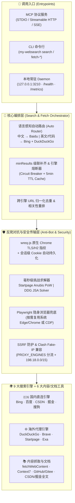

<div align="center">

# 🔍 MyWebSearch

**免 API Key 的多引擎 AI 联网搜索与网页正文提纯引擎**  
*MCP Server · CLI 命令行 · 本地常驻 Daemon · Agent Skill 协同*

**[🇨🇳 简体中文](./README-zh.md) | [🇺🇸 English](./README.md)**


[](https://m8ven.ai/mcp/wtznicy-my-websearch-1nmaw4)

</div>

---

## ✨ 为什么选择 MyWebSearch？

`my-websearch` 是专为 AI Agent（Claude Desktop、Cursor、Cherry Studio、Cline、ZCode 等）打造的**全栈联网检索与文档阅读基础设施**。无需信用卡或付费 API Key，开箱即享 **9 大国内外搜索引擎融合检索**、**Context7 官方技术文档直查**与**高纯度 Markdown 网页正文提取**。

- 🌐 **9 大引擎智能编排**：聚合国内直连引擎（**Bing、百度、CSDN、掘金、搜狗**）与海外高质量引擎（**DuckDuckGo、Brave、Startpage、Exa**），支持中英文自动路由（`auto`）、多词并发（`queries`）、跨引擎去重重排与 `minResults` 自动级联补位。
- 🛡️ **原生级反爬突破（零浏览器极速路径）**：
  - **Chrome TLS/HTTP2 指纹模拟**：基于 `wreq-js` 原生模拟现代 Chrome 握手与会话级 Cookie 持久化，大幅降低上游软降级与拦截率。
  - **内置轻量化挑战求解器**：纯算法毫秒级破解 **Startpage Anubis SHA-256 PoW 算力验证**与 **DuckDuckGo `d.js` (`isJsaChallenge`) HTML5/算术挑战**，无需拉起笨重的浏览器即可稳定穿透 `HTTP 202` / `429` 风控。
  - **深度去广告与真实链接还原**：自动剥离 Brave 赞助商广告、搜狗商业推广，并通过移动端双栈解析与 `uigs_para` 令牌重放直接还原搜狗加密跳转前的真实目标 URL。
- 📄 **AI 友好的正文提纯与 Markdown 转换**：
  - 内置 `@mozilla/readability` + 容器级智能降噪（`stripChromeNoiseWithGuard`），精准剥离 `<nav>`、`<aside>`、`<footer>`、侧边栏与面包屑噪声，同时**智能挽救 `<article><header><h1>` 文章主标题**。
  - 支持 `format: "markdown"`（基于 `turndown` + GFM 插件），无论走 Readability 还是容器回退路径，均完整保留代码块（` ``` `）、表格与标题层级。
- 📚 **内置 Context7 官方库文档检索**：原生集成 `resolveLibraryId` 与 `queryDocs`，无需额外部署 Context7 MCP Server 即可按版本检索最新框架/库官方文档与代码示例。
- 🌏 **为中国大陆网络与 Clash TUN/Fake-IP 深度优化**：
  - 支持 `PROXY_ENGINES` **按引擎白名单分流**（海外引擎走代理、国内引擎直连，告别全局代理导致的百度/CSDN 超时）。
  - 原生支持 `FAKE_IP_CIDRS`（默认放行 `198.18.0.0/15`），完美兼容 Clash TUN / Fake-IP 虚拟网卡环境，同时严守内网 SSRF 安全边界。

---

## 🏗️ 系统架构



---

## 🌍 9 大搜索引擎全景对比

| 引擎标识 | 区域 / 网络要求 | API Key | 核心反爬对抗与解析技术 | 最擅长场景 |
| :--- | :--- | :---: | :--- | :--- |
| **`bing`** | 🇨🇳 国内可直连 | 免 Key | `wreq-js` Chrome 指纹模拟 + Base64 真实 URL 解码 + 可选 Playwright 兜底 | 综合技术检索、中英混合查询 |
| **`baidu`** | 🇨🇳 国内可直连 | 免 Key | 百度跳转链接并发还原（`Location` 直取）+ 反爬验证页精准识别 | 中文资讯、国内政策、本土百科与社区 |
| **`csdn`** | 🇨🇳 国内可直连 | 免 Key | `wreq-js` 会话自动持久化阿里云 `https_waf_cookie` + 限流空壳自动重放 | 中文报错排查、国内开发踩坑笔记 |
| **`juejin`** | 🇨🇳 国内可直连 | 免 Key | 掘金官方 GraphQL/REST 搜索接口直调 | 前端/后端/移动端现代中文技术长文 |
| **`sogou`** | 🇨🇳 国内可直连 | 免 Key | 桌面 `/web` + 移动 `m.sogou.com` 双栈解析 + `uigs_para` 令牌还原真实 URL + 去广告 | 微信公众号文章外链、中文长尾词条 |
| **`duckduckgo`** | 🌐 大陆需代理 | 免 Key | Preload `d.js` JSONP + **内置 `isJsaChallenge` (`window.execDeep`) 挑战求解器** | 英文技术检索、开源项目与海外讨论 |
| **`startpage`** | 🌐 大陆需代理 | 免 Key | **内置 Anubis SHA-256 PoW 算力求解器** + `wreq-js` 会话 Cookie 免浏览器通行 | 谷歌同源搜索结果（高隐私、高准确度） |
| **`brave`** | 🌐 大陆需代理 | 免 Key | `wreq-js` 指纹直连 + 赞助商广告（`data-type="ad"` / `/a/redirect`）深度过滤 | 独立英文索引、高质量海外技术博客 |
| **`exa`** | 🌐 大陆可直连 API | 需免费 Key | 官方语义搜索 API（配置 `EXA_API_KEY` 启用，未配时快速失败不拖慢全局） | AI 论文、GitHub 深度语义相似检索 |

---

## 🛠️ 7 大 MCP 工具一览

| 工具名称 | 功能说明 | 关键参数与亮点 |
| :--- | :--- | :--- |
| **`search`** | 多引擎联合联网搜索 | 支持单查询 `query` 或并发多查询 `queries: string[]`、`engines`、`limit`、`minResults`（结果不足自动级联补跑） |
| **`fetchWebContent`** | 通用网页 / Markdown 正文提取 | 支持 `format: "markdown"`（保留代码块与表格）、`readability: true`、`includeLinks`、`startIndex` 分页、GBK/UTF-8 自动解码、导航/侧栏噪声剥离且保留文章 `<h1/h2>` |
| **`resolveLibraryId`** | 检索库/框架的 Context7 ID | 输入库名（如 `"Next.js"`、`"prisma"`），返回官方库 ID 及信誉/代码片段数量评分 |
| **`queryDocs`** | 查询库/框架的最新官方文档 | 按 Context7 库 ID（支持钉定版本如 `"/vercel/next.js@v15.1.8"`）获取最新 API 用法与代码示例 |
| **`fetchGithubReadme`** | 获取 GitHub / Gitee 仓库 README | 支持 HTTPS / SSH / `.git` URL；**Gitee 自动走官方 API（国内免代理秒开）** |
| **`fetchCsdnArticle`** | 获取 CSDN 博客文章全文 | 精准提取 `#content_views` 正文并转纯文本/结构化内容，支持浏览器 Cookie 自动续命 |
| **`fetchJuejinArticle`** | 获取稀土掘金文章全文 | 直调掘金文章接口提取干净正文；传 `format: "markdown"` 可保留代码围栏（含语言）与 GFM 表格 |

---

## 🚀 快速开始

### 1. 一键运行（NPX 免安装）

```bash
# 默认启动（兼容 STDIO + HTTP）
npx -y my-websearch@latest

# 🇨🇳 中国大陆推荐启动命令（海外引擎走本地代理，国内引擎保持高速直连）
USE_PROXY=true PROXY_URL=http://127.0.0.1:7890 PROXY_ENGINES=duckduckgo,exa,brave,startpage npx -y my-websearch@latest
```

### 2. 在主流 AI 客户端中配置 MCP

#### 🔹 Claude Desktop / Cursor / Windsurf / Cline (`mcpServers` 标准配置)

在配置文件中添加（中国大陆用户强烈建议保留下方 `env` 中的分流代理配置）：

```json
{
  "mcpServers": {
    "my-websearch": {
      "command": "npx",
      "args": ["-y", "my-websearch@latest"],
      "env": {
        "MODE": "stdio",
        "DEFAULT_SEARCH_ENGINE": "auto",
        "DEFAULT_MIN_RESULTS": "5",
        "USE_PROXY": "true",
        "PROXY_URL": "http://127.0.0.1:7890",
        "PROXY_ENGINES": "duckduckgo,exa,brave,startpage",
        "FAKE_IP_CIDRS": "198.18.0.0/15"
      }
    }
  }
}
```

> 💡 **Windows 原生命令行兼容写法**（若部分旧客户端找不到 `npx`，可使用 `cmd /c`）：
> ```json
> {
>   "mcpServers": {
>     "my-websearch": {
>       "command": "cmd",
>       "args": ["/c", "npx", "-y", "my-websearch@latest"],
>       "env": {
>         "MODE": "stdio",
>         "DEFAULT_SEARCH_ENGINE": "auto",
>         "SYSTEMROOT": "C:/Windows"
>       }
>     }
>   }
> }
> ```

#### 🔹 Cherry Studio（支持 STDIO 或 Streamable HTTP）

- **STDIO 模式**：直接粘贴上方 JSON 配置即可。
- **Streamable HTTP 模式**（先在终端运行 `npx my-websearch@latest` 启动服务，默认端口 `3211`）：
  ```json
  {
    "mcpServers": {
      "web-search": {
        "name": "MyWebSearch",
        "type": "streamableHttp",
        "baseUrl": "http://localhost:3211/mcp"
      }
    }
  }
  ```

#### 🔹 各 AI 框架配置文件路径速查

| 客户端 / 框架 | 配置文件路径 |
| :--- | :--- |
| **Claude Desktop** | macOS: `~/Library/Application Support/Claude/claude_desktop_config.json`<br/>Windows: `%APPDATA%\Claude\claude_desktop_config.json` |
| **Cursor** | `~/.cursor/mcp.json` 或项目级 `.cursor/mcp.json` |
| **ZCode / zcode** | `~/.zcode/cli/config.json` → `mcp.servers.mywebsearch.env` |
| **Gemini CLI / Antigravity** | `mcp_config.json` → `mcpServers.mywebsearch.env` |
| **DSH (DeepSeek Harness)** | `cordis.patch.yml` → `mcp-mywebsearch.env` |
| **Reasonix** | `~/.reasonix/config.toml` |

---

## 💻 CLI 命令行、本地常驻 Daemon 与 Agent Skill

除了作为 MCP Server 运行，`my-websearch` 还内置了完备的 **CLI 工具**与**本地常驻 HTTP Daemon（默认端口 `3210`）**，并支持通过 **Skill** 引导 AI Agent 自动发现和激活搜索能力。

### 1. 安装 Agent Skill（推荐给支持 Skills 的 Agent）

```bash
npx skills add https://gitee.com/wtznicy/my-websearch --skill my-websearch
```

### 2. CLI 与本地 Daemon 常用命令

```bash
# 全局安装
npm install -g my-websearch

# 启动本地常驻 Daemon（低延迟复用连接池、缓存与会话 Cookie）
my-websearch serve

# 查看 Daemon 健康状态与启用引擎
my-websearch status --json

# 命令行一次性搜索（若本地 Daemon 已运行则自动复用 Daemon）
my-websearch search "Model Context Protocol 最佳实践" --limit 5 --min-results 5 --json

# 提取网页为干净的 Markdown（自动去导航噪声、保留标题与代码块）
my-websearch fetch-web "https://blog.vuejs.org/posts/vue-3-5" --max-chars 15000 --json

# 清空内存中的 5 分钟搜索 TTL 缓存
my-websearch cache-clear
```

> 📊 **Prometheus 监控端点**：Daemon 运行时暴露只读监控接口 `GET /health`、`GET /status` 以及 `GET /metrics`（提供各引擎成功率、延迟分布、缓存命中率与内存指标）。完整 HTTP API 见 [docs/http-api.md](docs/http-api.md)。

---

## 📖 核心工具调用示例

### 1. `search` —— 多引擎搜索与多词并发

```json
{
  "queries": [
    "Rust tokio async runtime tutorial",
    "tokio spawn blocking best practices"
  ],
  "engines": ["duckduckgo", "bing", "startpage"],
  "limit": 8,
  "minResults": 6
}
```

### 2. `fetchWebContent` —— 网页提纯与 Markdown 格式化

```json
{
  "url": "https://blog.vuejs.org/posts/vue-3-5",
  "format": "markdown",
  "readability": true,
  "includeLinks": true,
  "maxChars": 20000,
  "startIndex": 0
}
```
> 当 `truncated: true` 时，返回体中包含 `nextStartIndex`，将其传入下一次调用的 `startIndex` 即可无缝翻页读取长文。

### 3. `resolveLibraryId` + `queryDocs` —— 检索最新库文档

```json
// 第一步：解析库 ID
{
  "libraryName": "Next.js",
  "query": "App Router middleware authentication"
}

// 第二步：按 ID 检索官方文档与代码片段
{
  "libraryId": "/vercel/next.js",
  "query": "how to protect routes in middleware.ts",
  "limit": 5
}
```

---

## ⚙️ 环境变量完整参考

| 变量名 | 默认值 | 可选值 / 格式 | 详细说明 |
| :--- | :--- | :--- | :--- |
| **`DEFAULT_SEARCH_ENGINE`** | `auto` | `auto`, `bing`, `baidu`, `csdn`, `juejin`, `sogou`, `duckduckgo`, `brave`, `startpage`, `exa` | 默认搜索引擎。`auto` 会按查询语言自动分流：中文查询走 `AUTO_ROUTE_ZH_ENGINES`，英文/代码查询走 `AUTO_ROUTE_EN_ENGINES` |
| **`AUTO_ROUTE_EN_ENGINES`** | `bing,duckduckgo` | 逗号分隔的引擎列表 | `auto` 模式下英文/技术查询并发使用的引擎组（双引擎互补，防止单引擎退化） |
| **`AUTO_ROUTE_ZH_ENGINES`** | `baidu` | 逗号分隔的引擎列表 | `auto` 模式下中文查询默认路由的引擎组（结果不足 `DEFAULT_MIN_RESULTS` 时自动级联 `bing`、`csdn` 等） |
| **`DEFAULT_MIN_RESULTS`** | `5` | 非负整数 | 搜索结果少于该阈值时，自动级联调用其他可用引擎补齐结果 |
| **`ALLOWED_SEARCH_ENGINES`** | 空（全部可用） | 逗号分隔的引擎列表 | 限制允许使用的搜索引擎白名单 |
| **`USE_PROXY`** | `false` | `true`, `false` | 是否显式开启 HTTP/HTTPS 代理（未开启时也会在需要时尝试读取系统代理） |
| **`PROXY_URL`** | `http://127.0.0.1:7890` | 合法代理 URL | 代理服务器地址（自动透传给 `axios` 与 `wreq-js` 原生会话） |
| **`PROXY_ENGINES`** | 空（全部走代理） | 逗号分隔的引擎列表 | **强烈推荐配置为 `duckduckgo,exa,brave,startpage`**：仅白名单内海外引擎走代理，国内引擎保持高速直连 |
| **`FAKE_IP_CIDRS`** | `198.18.0.0/15` | 逗号分隔的 CIDR | **Clash TUN / Fake-IP 用户必看**：将该网段视为代理虚拟 IP 放行，避免被 SSRF 防护误判为内网地址拦截 |
| **`BING_IMPERSONATE_TARGET`** | `chrome131` | `wreq-js` 浏览器指纹标识 | Bing HTTP 请求使用的 Chrome TLS/H2 指纹目标 |
| **`BING_PLAYWRIGHT_FALLBACK`** | `true` | `true`, `false` | 设为 `false` 时，Bing 遭遇反爬不拉起 Playwright 浏览器（省 ~400MB 内存），直接快速失败并交给 `minResults` 级联其他引擎 |
| **`STARTPAGE_PLAYWRIGHT_FALLBACK`** | `true` | `true`, `false` | Startpage 默认优先用内置 Anubis PoW 算力求解器直通；设为 `false` 时若 PoW 失败也不拉起浏览器 |
| **`EXA_API_KEY`** | 空 | Exa 官方 API Key | **可选**：仅在使用 `exa` 引擎时需要（前往 [dashboard.exa.ai](https://dashboard.exa.ai/api-keys) 免费获取） |
| **`CONTEXT7_API_KEY`** | 空 | Context7 API Key | **可选**：匿名享有 200 次/月免费配额；配置免费 Key（[context7.com/dashboard](https://context7.com/dashboard)）可大幅提升配额 |
| **`GITHUB_TOKEN`** | 空 | GitHub Personal Access Token | **可选**：提高 `fetchGithubReadme` 的速率上限（匿名 raw 额度在频繁抓取后会 403，导致抓取整体失败） |
| **`FETCH_WEB_INSECURE_TLS`** | `false` | `true`, `false` | 仅对 `fetchWebContent` 关闭 TLS 证书校验（仅在目标旧站点证书链损坏时临时启用） |
| **`MODE`** | `both` | `both`, `http`, `stdio` | MCP 服务器传输模式 |
| **`PORT`** | `3211` | `1-65535` | MCP HTTP/SSE 监听端口（CLI 本地 Daemon 默认使用 `3210`） |
| **`MCP_SESSION_TTL_MS`** | `1800000` | 毫秒 | MCP HTTP/SSE 会话空闲多久后被回收（默认 30 分钟） |
| **`MCP_MAX_SESSIONS`** | `100` | 正整数 | 保留的 MCP HTTP 会话上限，超出时优先回收最久未活跃的会话 |
| **`MCP_SESSION_REAPER_MS`** | `300000` | 毫秒 | 会话回收器的巡检间隔（默认 5 分钟） |
| **`MAX_CONCURRENT_SEARCHES`** | `0` | 非负整数 | Daemon 模式下全局最大并发搜索数（`0` 表示不限制） |
| **`METRICS_ENABLED`** | `false` | `true`, `false` | 是否启用 Prometheus 引擎性能与缓存命中率指标采集 |
| **`SECURITY_AUDIT`** | `false` | `true`, `false` | 是否输出 SSRF 拦截、TLS 白名单等安全审计日志 |
| **`LOG_LEVEL`** | `info` | `quiet`, `debug`, `info`, `warn`, `error` | 日志输出级别（`quiet` 完全静默） |

---

## 💡 常见问题与最佳实践

1. **中国大陆网络如何配代理最稳、最快？**
   - 请务必配置 `USE_PROXY=true` + `PROXY_URL=http://127.0.0.1:<你的代理端口>` + `PROXY_ENGINES=duckduckgo,exa,brave,startpage`。
   - 这样国内引擎（百度、Bing、CSDN、掘金、搜狗）走本地千兆直连，海外引擎（DuckDuckGo、Startpage、Brave）精准走代理（含 `wreq-js` TLS 指纹会话代理透传）。若未开代理直接请求海外引擎，内置的**快速可达性探针（3 秒超时）**会立即报错触发级联，绝不挂起拖慢整次搜索。
2. **开启 Clash TUN / Fake-IP 模式后报错 `is private IP address` 怎么办？**
   - Clash Fake-IP 会将公网域名解析到 `198.18.0.0/15` 保留网段。请确保环境变量中包含 `FAKE_IP_CIDRS=198.18.0.0/15`（新版本已默认包含该网段）。
3. **如何避免高并发下 Brave 触发 429 或 Bing 弹验证页？**
   - `brave` 对高频突发请求限流最严（触发 429 后冷却数分钟）。日常英文搜索推荐让 `auto` 路由使用 **`bing,duckduckgo`** 或搭配 **`startpage`**（均已内置挑战求解器，稳定且并发配额充裕）。
   - 如果不想让机器启动 Chromium 浏览器，可设置 `BING_PLAYWRIGHT_FALLBACK=false`，配合 `DEFAULT_MIN_RESULTS=5`，任何单引擎偶发限流都会在毫秒级内由其他引擎无缝补位。

---

## 🤝 贡献与致谢

欢迎提交 Issue 与 Pull Request！本地开发与运行测试非常简单：

```bash
npm install
npm run build
npm run test:vitest   # 运行 Vitest 单元测试套件（134+ 用例）
npm test              # 运行有界并发全量集成测试
```

### 致谢

**作者：wtznicy**

本项目基于 **Open-WebSearch**（原作者 Aas-ee）深度演进而来，感谢原作者的开创性工作。同时也向以下优秀开源项目致谢：
- **[wreq-js](https://www.npmjs.com/package/wreq-js)**：提供高性能 Chrome TLS/HTTP2 指纹模拟与原生会话管理
- **[Context7](https://context7.com)**（Upstash）：为 `resolveLibraryId` / `queryDocs` 提供实时官方文档索引
- **[Mozilla Readability](https://github.com/mozilla/readability) & [Turndown](https://github.com/mixmark-io/turndown)**：赋能高质量网页正文提纯与 GFM Markdown 转换
