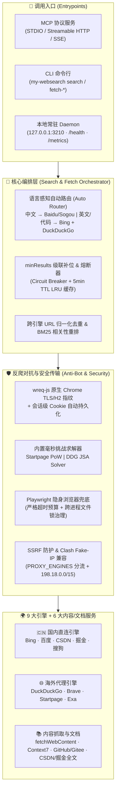

<div align="center">

# 🔍 MyWebSearch

**免 API Key 的多引擎 AI 联网检索与网页正文提纯引擎**  
*MCP Server · CLI 命令行 · 本地常驻 Daemon · 智能 Agent 协同*

**[🇨🇳 简体中文](./README-zh.md) | [🇺🇸 English](./README.md)**

[](https://www.npmjs.com/package/my-websearch)
[](https://www.npmjs.com/package/my-websearch)
[](./LICENSE)
[](https://github.com/wtznicy/my-websearch)
[](https://m8ven.ai/mcp/wtznicy-my-websearch-1nmaw4)

</div>

---

## ✨ 核心特性

`my-websearch` 是专为 AI Agent（Claude Desktop、Cursor、Cherry Studio、Windsurf、Cline、ZCode 等）打造的**全栈联网检索与技术文档基础设施**。无需付费 API Key，开箱即用：

- 🌐 **9 大引擎融合与自适应路由**  
  聚合国内直连（**Bing、百度、CSDN、掘金、搜狗**）与海外主流（**DuckDuckGo、Brave、Startpage、Exa**）。支持中文/英文按语种自动路由（`auto`）、多词并发检索（`queries`）、跨引擎去重排序与 `minResults` 自动级联补位。
- ⚡ **原生级反爬与算力求解（零浏览器毫秒直通）**  
  基于 `wreq-js` 原生模拟现代 Chrome TLS/HTTP2 指纹；内置轻量算法秒解 **Startpage Anubis SHA-256 PoW 算力挑战** 与 **DuckDuckGo `d.js` (`isJsaChallenge`) HTML5/算术挑战**；真实 URL 深度解密（搜狗 `uigs_para`、百度 `Location` 直取、Bing Base64 解码）；无需拉起 400MB 浏览器即可稳定穿透风控。
- 📄 **高纯度 Markdown 正文提纯**  
  整合 Mozilla Readability 与容器级智能降噪，剥离导航栏、侧边栏、页脚等干扰信息，精准保留文章主标题（`<article><header><h1>`）、代码围栏及 GFM 表格；支持长文无缝分页（`startIndex`）。
- 📚 **Context7 官方框架/库文档直查**  
  原生集成 `resolveLibraryId` 与 `queryDocs`，无需额外部署 Context7 服务即可按库名和钉定版本查询官方文档与最新代码示例，支持 HTTP 301 自动重定向追踪与配额自适应。
- 🌏 **零配置网络感知（Clash TUN / Fake-IP 完美适配）**  
  自动嗅探系统代理（Windows 注册表 / macOS scutil / Linux 环境变量），海外引擎走代理、国内引擎直连；原生支持 `198.18.0.0/15` 放行，无缝兼容 Clash TUN 虚拟网卡，严守内网 SSRF 安全边界。
- 🔌 **全形态接入支持**  
  支持 **MCP STDIO**（Claude/Cursor 极简接入）、**Streamable HTTP / SSE**（Cherry Studio 等远程客户端）、**终端 CLI** 一次性工具，以及**本地常驻 Daemon**（支持连接池复用与 `/metrics` Prometheus 监控）。

---

## 🏗️ 系统架构


```mermaid
flowchart TB
    subgraph Clients["🤖 调用入口 (Entrypoints)"]
        MCP["MCP 协议服务<br/>(STDIO / Streamable HTTP / SSE)"]
        CLI["CLI 命令行<br/>(my-websearch search / fetch-*)"]
        Daemon["本地常驻 Daemon<br/>(127.0.0.1:3210 · /health · /metrics)"]
    end

    subgraph Core["🧠 核心编排层 (Search & Fetch Orchestrator)"]
        Router["语言感知自动路由 (Auto Router)<br/>中文 → Baidu/Sogou | 英文/代码 → Bing + DuckDuckGo"]
        Cascade["minResults 级联补位 & 熔断器<br/>(Circuit Breaker + 5min TTL LRU 缓存)"]
        Ranker["跨引擎 URL 归一化去重 & BM25 相关性重排"]
    end

    subgraph Transport["🛡️ 反爬对抗与安全传输 (Anti-Bot & Security)"]
        Wreq["wreq-js 原生 Chrome TLS/H2 指纹<br/>+ 会话级 Cookie 自动持久化"]
        Solvers["内置毫秒挑战求解器<br/>Startpage PoW | DDG JSA Solver"]
        PW["Playwright 隐身浏览器兜底<br/>(严格超时预算 + 跨进程文件锁治理)"]
        Guard["SSRF 防护 & Clash Fake-IP 兼容<br/>(PROXY_ENGINES 分流 + 198.18.0.0/15)"]
    end

    subgraph Engines["🌍 9 大引擎 + 6 大内容/文档服务"]
        CN["🇨🇳 国内直连引擎<br/>Bing · 百度 · CSDN · 掘金 · 搜狗"]
        INTL["🌐 海外代理引擎<br/>DuckDuckGo · Brave · Startpage · Exa"]
        Docs["📚 内容抓取与文档<br/>fetchWebContent · Context7 · GitHub/Gitee · CSDN/掘金全文"]
    end

    Clients --> Core
    Core --> Transport
    Transport --> Engines
```

---

## 🌍 9 大搜索引擎一览

| 引擎标识 | 网络要求 | API Key | 核心技术与优势 | 最擅长场景 |
| :--- | :---: | :---: | :--- | :--- |
| **`bing`** | 🇨🇳 直连 | 免 Key | Chrome TLS 指纹 + Base64 真实链接解码 + 隐身兜底 | 综合技术检索、中英文混合查询 |
| **`baidu`** | 🇨🇳 直连 | 免 Key | 并发 `Location` 跳转直取 + 反爬验证页精准识别 | 中文资讯、本土百科、国内论坛 |
| **`csdn`** | 🇨🇳 直连 | 免 Key | 自动持久化阿里云 WAF Cookie + 空壳响应智能重试 | 中文报错排查、开发踩坑笔记 |
| **`juejin`** | 🇨🇳 直连 | 免 Key | 掘金官方接口直调，极速提取干净长文 | 前端/后端现代中文高质量技术博文 |
| **`sogou`** | 🇨🇳 直连 | 免 Key | 桌面/移动双栈解析 + `uigs_para` 令牌还原 + 自动去推广 | 微信公众号外链、中文长尾问答 |
| **`duckduckgo`** | 🌐 需代理 | 免 Key | Preload `d.js` + **内置 `isJsaChallenge` 求解器** | 英文技术检索、海外开源讨论 |
| **`startpage`** | 🌐 需代理 | 免 Key | **内置 Anubis SHA-256 PoW 算力求解器** + 隐私直通 | 谷歌同源高质量检索（隐私高保真） |
| **`brave`** | 🌐 需代理 | 免 Key | 原生指纹直连 + 赞助商商业推广深度剥离 | 独立海外英文索引、技术博客 |
| **`exa`** | 🌐 API直连 | 选配免费 Key | 官方语义搜索 API（未配置时自动跳过，不阻断级联） | 深度语义相似搜索、学术与技术前沿 |

---

## 🛠️ 7 大 MCP 工具

| 工具名称 | 功能定位 | 关键特性 |
| :--- | :--- | :--- |
| **`search`** | 多引擎联合联网检索 | 支持单词 `query` 或并发多词 `queries: string[]`，支持 `minResults` 自动级联补齐 |
| **`fetchWebContent`** | 通用网页正文与 Markdown 提纯 | 支持 `format: "markdown"`、智能保留文章主标题、去导航降噪、长文分页（`startIndex`） |
| **`resolveLibraryId`** | 查询技术库的 Context7 规范 ID | 输入开源库名（如 `"Next.js"`），返回 Context7 官方标准 ID 与信誉评分，支持 301 自动重定向 |
| **`queryDocs`** | 获取开源库的最新官方文档/代码 | 按 Context7 ID 获取最新 API 规范与示例代码，支持版本钉定（如 `"/vercel/next.js@v15.1.8"`） |
| **`fetchGithubReadme`** | 抓取 GitHub / Gitee 仓库 README | 支持 HTTPS / SSH 链接；**Gitee 自动走官方 API（国内秒开）** |
| **`fetchCsdnArticle`** | 抓取 CSDN 技术博客全文 | 精准提取文章主体容器，支持浏览器会话 Cookie 自动续期 |
| **`fetchJuejinArticle`** | 抓取稀土掘金技术长文 | 直调官方接口，传 `format: "markdown"` 完整保留代码高亮围栏与 GFM 表格 |

---

## 🚀 快速接入

### 1. NPX 一键运行（零配置）

无需安装，开箱即用：

```bash
npx -y my-websearch@latest
```

> 💡 **全自动网络感知**：项目默认自动探测操作系统的系统代理。只要本地运行了 Clash / v2ray / Surge 等工具，海外引擎自动走代理，国内引擎自动走高速直连；Clash Fake-IP（`198.18.0.0/15`）已内置放行。

### 2. 主流 AI 客户端配置

#### 🔹 Claude Desktop / Cursor / Windsurf / Cline (STDIO 极简模式)

在对应客户端的 MCP 配置文件中加入：

```json
{
  "mcpServers": {
    "my-websearch": {
      "command": "npx",
      "args": ["-y", "my-websearch@latest"],
      "env": {
        "MODE": "stdio"
      }
    }
  }
}
```

*(Windows 环境若遇环境缺失，可将 `command` 设为 `cmd`，`args` 设为 `["/c", "npx", "-y", "my-websearch@latest"]`)*

#### 🔹 Cherry Studio (Streamable HTTP 模式)

在终端运行 `npx my-websearch@latest`（默认端口 `3211`），并在 Cherry Studio 中配置：

```json
{
  "mcpServers": {
    "web-search": {
      "name": "MyWebSearch",
      "type": "streamableHttp",
      "baseUrl": "http://localhost:3211/mcp"
    }
  }
}
```

---

## 💻 CLI 命令行与常驻 Daemon

`my-websearch` 可直接在终端作为高效的 CLI 工具或系统 Daemon 运行：

```bash
# 全局安装
npm install -g my-websearch

# 启动本地常驻 Daemon（复用底层连接池与缓存，默认端口 3210）
my-websearch serve

# 终端一次性搜索（自动复用运行中的 Daemon）
my-websearch search "Model Context Protocol 最佳实践" --limit 5 --min-results 5 --json

# 提取网页正文为纯净 Markdown
my-websearch fetch-web "https://blog.vuejs.org/posts/vue-3-5" --max-chars 15000 --json

# 查看 Daemon 状态与 Prometheus 指标（/health, /status, /metrics）
my-websearch status --json

# 清空内存搜索缓存
my-websearch cache-clear
```

---

## ⚙️ 配置中心与环境变量

### 统一配置文件（`~/.my-websearch/config.json`）

为避免在不同 MCP 客户端中反复声明参数，支持全局统一配置：

```json
{
  "apiKeys": {
    "context7": "ctx7sk-...",
    "exa": "..."
  },
  "proxy": {
    "url": "http://127.0.0.1:7897",
    "useProxy": false,
    "engines": ["duckduckgo", "exa", "brave", "startpage"]
  }
}
```

### 核心环境变量速查

| 分类 | 变量名 | 默认值 | 作用与说明 |
| :--- | :--- | :--- | :--- |
| **路由编排** | `DEFAULT_SEARCH_ENGINE` | `auto` | 默认引擎；`auto` 会按语言将中文分流到百度/搜狗，英文分流到 Bing/DuckDuckGo |
| | `DEFAULT_MIN_RESULTS` | `5` | 结果不足该阈值时触发跨引擎级联补齐 |
| | `ALLOWED_SEARCH_ENGINES` | 全部 | 限制启用的引擎白名单（逗号分隔） |
| **代理与网络** | `USE_PROXY` | `false` | 是否强制开启代理（未配置时自动嗅探系统代理） |
| | `PROXY_URL` | `http://127.0.0.1:7890` | 代理服务器地址 |
| | `PROXY_ENGINES` | 全部走代理 | **推荐设为 `duckduckgo,exa,brave,startpage`**（仅海外引擎代理，国内直连） |
| | `FAKE_IP_CIDRS` | `198.18.0.0/15` | Clash Fake-IP 放行网段，避免误触 SSRF 拦截 |
| **服务与并发** | `MODE` | `both` | MCP 传输模式：`stdio`、`http` 或 `both` |
| | `PORT` | `3211` | MCP HTTP 服务监听端口（Daemon 默认使用 `3210`） |
| | `MAX_CONCURRENT_SEARCHES`| `20` | Daemon 模式下并发搜索保护上限（`0` 表示不限制） |
| | `MCP_MAX_SESSIONS` | `100` | 保留的最大并发会话数，超限时触发 429 保护与自动回收 |
| **降级兜底** | `BING_PLAYWRIGHT_FALLBACK` | `true` | Bing 遇阻时是否允许拉起无头浏览器（设为 `false` 可节约内存交由级联补位） |

---

## 🤝 参与开发与测试

欢迎提交 Issue 与 Pull Request！本地开发与测试命令：

```bash
npm install
npm run build
npm test              # 执行 255 个 Vitest 纯单元测试（33 个套件，秒级完成且 100% 确定性）
npm run test:live     # 执行外网有界并发实时集成测试
npm run eval:live     # 执行 22 用例真实 STDIO JSON-RPC 评测套件
```

### 致谢

**Author: wtznicy**

本项目基于 **Open-WebSearch**（原作者 Aas-ee）深度演进而来，特此致谢。同时感谢以下开源项目：
- **[wreq-js](https://www.npmjs.com/package/wreq-js)**：高性能原生 Chrome TLS/HTTP2 指纹与会话管理
- **[Context7](https://context7.com)**：实时权威官方框架/库文档索引
- **[Mozilla Readability](https://github.com/mozilla/readability) & [Turndown](https://github.com/mixmark-io/turndown)**：网页正文提纯与 Markdown 格式转换
