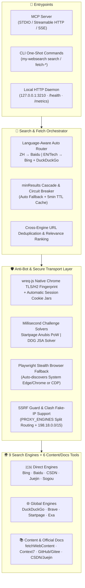

<div align="center">

# 🔍 MyWebSearch

**Keyless Multi-Engine AI Web Search & High-Purity Content Extraction Engine**  
*MCP Server · CLI · Local HTTP Daemon · Skill-Guided Agent Workflows*

**[🇨🇳 简体中文](./README-zh.md) | [🇺🇸 English](./README.md)**


[](https://m8ven.ai/mcp/wtznicy-my-websearch-1nmaw4)

</div>

---

## ✨ Why MyWebSearch?

`my-websearch` is a full-stack web retrieval and documentation engine built for AI coding agents and MCP clients (**Claude Desktop, Cursor, Windsurf, Cherry Studio, Cline, ZCode**, etc.). It delivers **9-engine federated search**, **version-pinned official library documentation via Context7**, and **clean Markdown web page extraction**—with **zero paid API keys required**.

- 🌐 **9-Engine Smart Orchestration**: Combines direct domestic engines (**Bing, Baidu, CSDN, Juejin, Sogou**) and global engines (**DuckDuckGo, Brave, Startpage, Exa**) with language-aware `auto` routing, parallel multi-query execution (`queries: string[]`), cross-engine URL deduplication/ranking, circuit breakers, and `minResults` automatic cascade fallback.
- 🛡️ **Native Anti-Bot & Challenge Solvers (Zero-Browser Fast Path)**:
  - **Chrome TLS/HTTP2 Fingerprint Impersonation**: Powered by `wreq-js` with persistent session cookie jars (e.g., automatic Alibaba Cloud `https_waf_cookie` persistence on CSDN and Chrome 131/133 TLS handshakes on Bing/Brave/Startpage).
  - **Millisecond Cryptographic & JS Challenge Solvers**: Built-in pure-JS/Rust solvers for **Startpage's Anubis SHA-256 Proof-of-Work (PoW)** and **DuckDuckGo's `d.js` (`isJsaChallenge` / `window.execDeep`) HTML5-parser + arithmetic challenge**—bypassing HTTP 202 / 429 anti-bot walls in milliseconds without spawning a 400MB headless browser.
  - **Deep Ad-Stripping & Real URL Resolution**: Automatically strips sponsored ads on Brave (`data-type="ad"`, `/a/redirect`) and Sogou, and resolves encrypted redirect links (`/link?url=`, `uigs_para` token replay, Baidu `Location` headers, Bing `u=a1...` Base64 links) to clean target URLs.
- 📄 **AI-Ready Content Extraction & GFM Markdown**:
  - Combines `@mozilla/readability` with container-level noise stripping (`stripChromeNoiseWithGuard`) to remove `<nav>`, `<aside>`, `<footer>`, sidebars, and breadcrumbs while **preserving `<article><header><h1>` article titles**.
  - Full `format: "markdown"` support (`turndown` + GFM tables/fenced code blocks) across both Readability and container-fallback paths, plus automatic GBK/GB2312 decoding and `startIndex` pagination.
- 📚 **Built-in Context7 Official Library Docs**: Native `resolveLibraryId` and `queryDocs` tools fetch up-to-date, version-specific documentation and code snippets without running a separate Context7 MCP server.
- 🌏 **Split-Horizon Proxy (`PROXY_ENGINES`) & Clash Fake-IP Ready**:
  - Route only overseas engines (`duckduckgo,exa,brave,startpage`) through your proxy while keeping domestic engines on fast direct connections.
  - Built-in `FAKE_IP_CIDRS` (`198.18.0.0/15` enabled by default) works seamlessly with Clash TUN / Fake-IP setups while enforcing strict SSRF protection against private-network access.

---

## 🏗️ Architecture



---

## 🌍 9 Search Engines Overview

| Engine | Connectivity (Mainland China) | API Key | Anti-Bot & Parsing Architecture | Best For |
| :--- | :--- | :---: | :--- | :--- |
| **`bing`** | 🇨🇳 Direct | None | `wreq-js` Chrome TLS impersonation + Base64 `u=a1` URL decoding + optional Playwright fallback | General technical search, mixed EN/ZH queries |
| **`baidu`** | 🇨🇳 Direct | None | Parallel redirect resolution (`Location` header extraction) + anti-bot page detection | Chinese news, documentation, domestic communities |
| **`csdn`** | 🇨🇳 Direct | None | `wreq-js` session auto-persisting Alibaba Cloud `https_waf_cookie` + empty-shell auto-retry | Chinese error messages, debugging notes |
| **`juejin`** | 🇨🇳 Direct | None | Official Juejin search API integration | Modern frontend/backend/mobile Chinese articles |
| **`sogou`** | 🇨🇳 Direct | None | Desktop `/web` + Mobile `m.sogou.com` dual parser + `uigs_para` real URL resolution + ad filtering | WeChat ecosystem articles & Chinese long-tail queries |
| **`duckduckgo`** | 🌐 Proxy in CN | None | Preload `d.js` JSONP + **built-in `isJsaChallenge` (`window.execDeep`) HTML5/math solver** | English technical search, open-source discussions |
| **`startpage`** | 🌐 Proxy in CN | None | **Built-in Anubis SHA-256 PoW solver** + `wreq-js` session cookies (no browser needed) | Google-backed search results with high privacy |
| **`brave`** | 🌐 Proxy in CN | None | `wreq-js` TLS fingerprint + strict sponsored-ad filtering (`data-type="ad"`, `/a/redirect`) | Independent English index & technical blogs |
| **`exa`** | 🌐 Direct API | Optional Free Key | Official semantic search API (enabled via `EXA_API_KEY`; fails fast if unset) | AI papers, GitHub repositories, semantic lookup |

---

## 🛠️ 7 MCP Tools Reference

| Tool Name | Purpose | Key Parameters & Highlights |
| :--- | :--- | :--- |
| **`search`** | Multi-engine federated web search | Supports `query` or parallel `queries: string[]`, `engines`, `limit`, `minResults` (auto-cascades to additional engines when results are insufficient) |
| **`fetchWebContent`** | Generic web page & Markdown extraction | Supports `format: "markdown"` (preserves code blocks & tables), `readability: true`, `includeLinks`, `startIndex` pagination, GBK/UTF-8 auto-decoding, chrome noise stripping while rescuing `<article><header><h1/h2>` titles |
| **`resolveLibraryId`** | Resolve package name to Context7 ID | Turns `"Next.js"`, `"prisma"`, etc. into Context7 library IDs with trust & snippet count metadata |
| **`queryDocs`** | Fetch official versioned library docs | Retrieves code examples and API docs by Context7 ID (supports version pinning like `"/vercel/next.js@v15.1.8"`) |
| **`fetchGithubReadme`** | Fetch GitHub or Gitee repo README | Supports HTTPS, SSH, `.git` URLs; **Gitee uses official API (reachable in mainland China without proxy)** |
| **`fetchCsdnArticle`** | Fetch full CSDN blog article | Clean `#content_views` extraction with automatic browser-cookie fallback if blocked |
| **`fetchJuejinArticle`** | Fetch full Juejin article | Direct API extraction returning clean article body; pass `format: "markdown"` to keep fenced code blocks (with language) and GFM tables |

---

## 🚀 Quick Start

### 1. Run Immediately with NPX

```bash
# Basic startup (STDIO + HTTP)
npx -y my-websearch@latest

# 🇨🇳 Recommended for Mainland China (Overseas engines via proxy, domestic engines direct)
USE_PROXY=true PROXY_URL=http://127.0.0.1:7890 PROXY_ENGINES=duckduckgo,exa,brave,startpage npx -y my-websearch@latest
```

### 2. Configure in MCP Clients

#### 🔹 Claude Desktop / Cursor / Windsurf / Cline (`mcpServers` Config)

```json
{
  "mcpServers": {
    "my-websearch": {
      "command": "npx",
      "args": ["-y", "my-websearch@latest"],
      "env": {
        "MODE": "stdio",
        "DEFAULT_SEARCH_ENGINE": "auto",
        "DEFAULT_MIN_RESULTS": "5",
        "USE_PROXY": "true",
        "PROXY_URL": "http://127.0.0.1:7890",
        "PROXY_ENGINES": "duckduckgo,exa,brave,startpage",
        "FAKE_IP_CIDRS": "198.18.0.0/15"
      }
    }
  }
}
```

> 💡 **Windows CMD Wrapper** (if your client requires `cmd /c` to locate `npx`):
> ```json
> {
>   "mcpServers": {
>     "my-websearch": {
>       "command": "cmd",
>       "args": ["/c", "npx", "-y", "my-websearch@latest"],
>       "env": {
>         "MODE": "stdio",
>         "DEFAULT_SEARCH_ENGINE": "auto",
>         "SYSTEMROOT": "C:/Windows"
>       }
>     }
>   }
> }
> ```

#### 🔹 Cherry Studio (STDIO or Streamable HTTP)

- **STDIO Mode**: Use the standard JSON config above.
- **Streamable HTTP Mode** (start server with `npx my-websearch@latest`, default port `3211`):
  ```json
  {
    "mcpServers": {
      "web-search": {
        "name": "MyWebSearch",
        "type": "streamableHttp",
        "baseUrl": "http://localhost:3211/mcp"
      }
    }
  }
  ```

#### 🔹 Client Config File Locations

| Client / Harness | Config File Location |
| :--- | :--- |
| **Claude Desktop** | macOS: `~/Library/Application Support/Claude/claude_desktop_config.json`<br/>Windows: `%APPDATA%\Claude\claude_desktop_config.json` |
| **Cursor** | `~/.cursor/mcp.json` or workspace `.cursor/mcp.json` |
| **ZCode / zcode** | `~/.zcode/cli/config.json` → `mcp.servers.mywebsearch.env` |
| **Gemini CLI / Antigravity** | `mcp_config.json` → `mcpServers.mywebsearch.env` |
| **DSH (DeepSeek Harness)** | `cordis.patch.yml` → `mcp-mywebsearch.env` |
| **Reasonix** | `~/.reasonix/config.toml` |

---

## 💻 CLI, Local HTTP Daemon & Agent Skill

Beyond MCP, `my-websearch` provides a fast **CLI** and a **long-lived Local HTTP Daemon (`127.0.0.1:3210`)** that keeps connection pools, 5-minute search caches, and solved anti-bot sessions warm across calls.

### 1. Install the Agent Skill

```bash
npx skills add https://gitee.com/wtznicy/my-websearch --skill my-websearch
```

### 2. Common CLI & Daemon Commands

```bash
# Install globally
npm install -g my-websearch

# Start the background-ready local HTTP daemon (port 3210)
my-websearch serve

# Check daemon health and active configuration
my-websearch status --json

# Run a one-shot search (automatically reuses the local daemon if running)
my-websearch search "Model Context Protocol specification" --limit 5 --min-results 5 --json

# Extract clean Markdown from any web page
my-websearch fetch-web "https://blog.vuejs.org/posts/vue-3-5" --max-chars 15000 --json

# Clear the 5-minute in-memory search cache
my-websearch cache-clear
```

> 📊 **Prometheus Metrics & Health Endpoints**: The daemon exposes `GET /health`, `GET /status`, and `GET /metrics` (engine latency, success/failure counters, cache hit ratio, memory/uptime). See [docs/http-api.md](docs/http-api.md) for the complete HTTP API.

---

## 📖 Tool Usage Examples

### 1. `search` — Multi-Engine & Multi-Query Search

```json
{
  "queries": [
    "Rust tokio async runtime tutorial",
    "tokio spawn blocking best practices"
  ],
  "engines": ["duckduckgo", "bing", "startpage"],
  "limit": 8,
  "minResults": 6
}
```

### 2. `fetchWebContent` — Clean Markdown Extraction

```json
{
  "url": "https://blog.vuejs.org/posts/vue-3-5",
  "format": "markdown",
  "readability": true,
  "includeLinks": true,
  "maxChars": 20000,
  "startIndex": 0
}
```
> When `truncated: true`, pass the returned `nextStartIndex` as `startIndex` in your next call to page through long documents.

### 3. `resolveLibraryId` + `queryDocs` — Official Library Documentation

```json
// Step 1: Resolve library ID
{
  "libraryName": "Next.js",
  "query": "App Router middleware authentication"
}

// Step 2: Query version-specific documentation snippets
{
  "libraryId": "/vercel/next.js",
  "query": "how to protect routes in middleware.ts",
  "limit": 5
}
```

---

## ⚙️ Environment Variables Reference

| Variable | Default | Options / Format | Description |
| :--- | :--- | :--- | :--- |
| **`DEFAULT_SEARCH_ENGINE`** | `auto` | `auto`, `bing`, `baidu`, `csdn`, `juejin`, `sogou`, `duckduckgo`, `brave`, `startpage`, `exa` | Default engine. `auto` routes Chinese queries to `AUTO_ROUTE_ZH_ENGINES` and English/technical queries to `AUTO_ROUTE_EN_ENGINES` |
| **`AUTO_ROUTE_EN_ENGINES`** | `bing,duckduckgo` | Comma-separated engines | Parallel engine group for English/technical queries under `auto` routing |
| **`AUTO_ROUTE_ZH_ENGINES`** | `baidu` | Comma-separated engines | Primary engine group for Chinese queries under `auto` routing (auto-cascades via `minResults` when needed) |
| **`DEFAULT_MIN_RESULTS`** | `5` | Non-negative integer | Automatically cascades to other engines when initial engines return fewer than `N` results |
| **`ALLOWED_SEARCH_ENGINES`** | empty (all) | Comma-separated engines | Restrict which search engines can be used |
| **`USE_PROXY`** | `false` | `true`, `false` | Enable explicit HTTP/HTTPS proxy (if unset, OS system proxy is auto-detected when needed) |
| **`PROXY_URL`** | `http://127.0.0.1:7890` | Valid proxy URL | Proxy URL (automatically passed to both `axios` and `wreq-js` native TLS sessions) |
| **`PROXY_ENGINES`** | empty (all) | Comma-separated engines | **Recommended for Mainland China: `duckduckgo,exa,brave,startpage`**. Routes only listed engines via proxy while domestic engines stay direct |
| **`FAKE_IP_CIDRS`** | `198.18.0.0/15` | Comma-separated CIDRs | **Required for Clash TUN / Fake-IP**: treats DNS answers in these ranges as synthetic proxy IPs instead of blocking them as private IPs |
| **`BING_IMPERSONATE_TARGET`** | `chrome131` | `wreq-js` browser target | Browser TLS/HTTP2 fingerprint target used for Bing HTTP requests |
| **`BING_PLAYWRIGHT_FALLBACK`** | `true` | `true`, `false` | Set `false` to skip launching Playwright when Bing is challenged (saves ~400MB RAM and lets `minResults` cascade to lighter engines) |
| **`STARTPAGE_PLAYWRIGHT_FALLBACK`** | `true` | `true`, `false` | Startpage uses the built-in Anubis SHA-256 PoW solver first; set `false` to disable Playwright fallback if PoW fails |
| **`EXA_API_KEY`** | empty | Exa API Key | **Optional**: only required if you explicitly use the `exa` engine (get a free key at [dashboard.exa.ai](https://dashboard.exa.ai/api-keys)) |
| **`CONTEXT7_API_KEY`** | empty | Context7 API Key | **Optional**: anonymous usage includes 200 requests/month per egress IP; set a free key ([context7.com/dashboard](https://context7.com/dashboard)) for higher quotas |
| **`GITHUB_TOKEN`** | empty | GitHub Personal Access Token | **Optional**: raises the rate limit for `fetchGithubReadme` (anonymous raw quota returns 403 under frequent re-fetching, failing the fetch entirely) |
| **`FETCH_WEB_INSECURE_TLS`** | `false` | `true`, `false` | Disable TLS verification for `fetchWebContent` only (use only for legacy sites with broken certificate chains) |
| **`MODE`** | `both` | `both`, `http`, `stdio` | MCP server transport mode |
| **`PORT`** | `3211` | `1-65535` | MCP HTTP/SSE listen port (CLI local daemon uses `3210` by default) |
| **`MCP_SESSION_TTL_MS`** | `1800000` | Milliseconds | Idle TTL for MCP HTTP/SSE sessions before the reaper closes them (default 30 min) |
| **`MCP_MAX_SESSIONS`** | `100` | Positive integer | Max retained MCP HTTP sessions; the least-recently-active ones are closed first |
| **`MCP_SESSION_REAPER_MS`** | `300000` | Milliseconds | How often the session reaper runs (default 5 min) |
| **`MAX_CONCURRENT_SEARCHES`** | `0` | Non-negative integer | Max concurrent searches in daemon mode (`0` = unlimited) |
| **`METRICS_ENABLED`** | `false` | `true`, `false` | Enable Prometheus metrics collection (`GET /metrics`) |
| **`SECURITY_AUDIT`** | `false` | `true`, `false` | Enable security audit logging (SSRF blocks, TLS overrides) |
| **`LOG_LEVEL`** | `info` | `quiet`, `debug`, `info`, `warn`, `error` | Logging verbosity (`quiet` silences startup and runtime logs) |

---

## 🤝 Contributing & Acknowledgements

Issues and Pull Requests are welcome! To build and run the test suite locally:

```bash
npm install
npm run build
npm run test:vitest   # Run 134+ Vitest unit tests
npm test              # Run bounded-concurrency integration test suite
```

### Acknowledgements

**Author: wtznicy**

This project evolved from **Open-WebSearch** (originally created by Aas-ee) — special thanks to the original author. Thanks also to:
- **[wreq-js](https://www.npmjs.com/package/wreq-js)** for native Chrome TLS/HTTP2 fingerprint impersonation and session cookie management
- **[Context7](https://context7.com)** (Upstash) for powering `resolveLibraryId` and `queryDocs`
- **[Mozilla Readability](https://github.com/mozilla/readability) & [Turndown](https://github.com/mixmark-io/turndown)** for clean article extraction and GFM Markdown conversion
