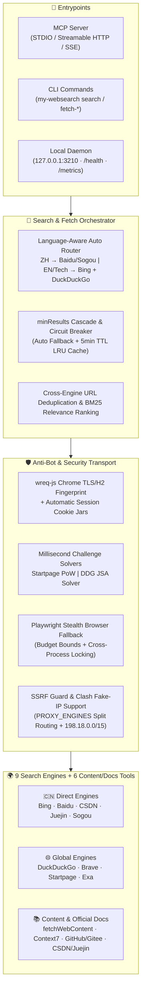

<div align="center">

# 🔍 MyWebSearch

**Keyless Multi-Engine AI Web Search & High-Purity Content Extraction Engine**  
*MCP Server · CLI · Local HTTP Daemon · Skill-Guided Agent Workflows*

**[🇨🇳 简体中文](./README-zh.md) | [🇺🇸 English](./README.md)**

[](https://www.npmjs.com/package/my-websearch)
[](https://www.npmjs.com/package/my-websearch)
[](./LICENSE)
[](https://github.com/wtznicy/my-websearch)
[](https://m8ven.ai/mcp/wtznicy-my-websearch-1nmaw4)

</div>

---

## ✨ Features

`my-websearch` is a full-stack search and technical documentation engine built specifically for AI coding agents (**Claude Desktop, Cursor, Cherry Studio, Windsurf, Cline, ZCode**, etc.). It requires **zero paid API keys**:

- 🌐 **9-Engine Federated Search & Smart Routing**  
  Aggregates direct domestic engines (**Bing, Baidu, CSDN, Juejin, Sogou**) and global engines (**DuckDuckGo, Brave, Startpage, Exa**). Features automatic language-aware routing (`auto`), parallel multi-query execution (`queries: string[]`), URL deduplication, and automatic `minResults` cascading fallback.
- ⚡ **Native Anti-Bot & Proof-of-Work Solvers (Zero-Browser Fast Path)**  
  Built on `wreq-js` with native Chrome TLS/HTTP2 handshake emulation and persistent session cookies. Includes pure-JS/Rust solvers for **Startpage's Anubis SHA-256 PoW challenge** and **DuckDuckGo's `d.js` (`isJsaChallenge`) HTML5/arithmetic challenge**, bypassing anti-bot walls in milliseconds without launching a 400MB browser. Real URL decryption for Sogou (`uigs_para`), Baidu `Location`, and Bing Base64 links.
- 📄 **High-Purity Markdown Article Extraction**  
  Combines Mozilla Readability with intelligent chrome noise stripping. Removes `<nav>`, `<aside>`, `<footer>`, and breadcrumbs while faithfully preserving article titles (`<article><header><h1>`), code blocks, and GFM tables. Supports seamless pagination (`startIndex`).
- 📚 **Official Context7 Library Docs Lookup**  
  Integrated `resolveLibraryId` and `queryDocs` allow searching version-pinned official documentation and code examples without hosting a separate Context7 server. Features automatic HTTP 301 canonical ID tracking and runtime quota fallback.
- 🌏 **Zero-Config Network Detection & Clash Fake-IP Ready**  
  Auto-detects OS system proxies (Windows Registry / macOS scutil / Linux env). Automatically routes overseas engines through proxy while keeping domestic engines on fast direct lines. Pre-whitelists `198.18.0.0/15` for Clash TUN / Fake-IP compatibility while enforcing strict SSRF security bounds.
- 🔌 **Versatile Deployment Modes**  
  Works seamlessly across **MCP STDIO** (Claude Desktop/Cursor), **Streamable HTTP / SSE** (Cherry Studio/remote clients), **CLI one-shot commands**, and a **Local HTTP Daemon** with connection pool reuse and Prometheus `/metrics` monitoring.

---

## 🏗️ Architecture


```mermaid
flowchart TB
    subgraph Clients["🤖 Entrypoints"]
        MCP["MCP Server<br/>(STDIO / Streamable HTTP / SSE)"]
        CLI["CLI Commands<br/>(my-websearch search / fetch-*)"]
        Daemon["Local Daemon<br/>(127.0.0.1:3210 · /health · /metrics)"]
    end

    subgraph Core["🧠 Search & Fetch Orchestrator"]
        Router["Language-Aware Auto Router<br/>ZH → Baidu/Sogou | EN/Tech → Bing + DuckDuckGo"]
        Cascade["minResults Cascade & Circuit Breaker<br/>(Auto Fallback + 5min TTL LRU Cache)"]
        Ranker["Cross-Engine URL Deduplication & BM25 Relevance Ranking"]
    end

    subgraph Transport["🛡️ Anti-Bot & Security Transport"]
        Wreq["wreq-js Chrome TLS/H2 Fingerprint<br/>+ Automatic Session Cookie Jars"]
        Solvers["Millisecond Challenge Solvers<br/>Startpage PoW | DDG JSA Solver"]
        PW["Playwright Stealth Browser Fallback<br/>(Budget Bounds + Cross-Process Locking)"]
        Guard["SSRF Guard & Clash Fake-IP Support<br/>(PROXY_ENGINES Split Routing + 198.18.0.0/15)"]
    end

    subgraph Engines["🌍 9 Search Engines + 6 Content/Docs Tools"]
        CN["🇨🇳 Direct Engines<br/>Bing · Baidu · CSDN · Juejin · Sogou"]
        INTL["🌐 Global Engines<br/>DuckDuckGo · Brave · Startpage · Exa"]
        Docs["📚 Content & Official Docs<br/>fetchWebContent · Context7 · GitHub/Gitee · CSDN/Juejin"]
    end

    Clients --> Core
    Core --> Transport
    Transport --> Engines
```

---

## 🌍 9 Search Engines

| Engine | Mainland China Connectivity | API Key | Core Technology | Best For |
| :--- | :---: | :---: | :--- | :--- |
| **`bing`** | 🇨🇳 Direct | None | Chrome TLS impersonation + Base64 real URL resolution + stealth fallback | General technical search, mixed EN/ZH queries |
| **`baidu`** | 🇨🇳 Direct | None | Concurrent `Location` redirect resolution + anti-bot detection | Chinese news, documentation, domestic forums |
| **`csdn`** | 🇨🇳 Direct | None | WAF cookie jar persistence + empty response auto-retry | Chinese error logs, debugging tutorials |
| **`juejin`** | 🇨🇳 Direct | None | Direct official API querying for clean long-form articles | Modern frontend/backend technical blogs |
| **`sogou`** | 🇨🇳 Direct | None | Desktop & mobile dual parsing + `uigs_para` token decoding + ad removal | WeChat ecosystem links & long-tail queries |
| **`duckduckgo`** | 🌐 Proxy in CN | None | Preload `d.js` + **built-in `isJsaChallenge` JS solver** | English technical search & open-source discussions |
| **`startpage`** | 🌐 Proxy in CN | None | **Built-in Anubis SHA-256 PoW solver** + cookie session (no browser needed) | Google-backed high-privacy results |
| **`brave`** | 🌐 Proxy in CN | None | Native TLS fingerprinting + strict sponsored ad stripping | Independent English index & technical blogs |
| **`exa`** | 🌐 Direct API | Optional Free Key | Official semantic search API (skipped if key is unset) | Semantic similarity, AI research & papers |

---

## 🛠️ 7 MCP Tools

| Tool Name | Purpose | Key Highlights |
| :--- | :--- | :--- |
| **`search`** | Multi-engine federated search | Supports `query` or parallel `queries: string[]`, `engines`, `limit`, and `minResults` cascading |
| **`fetchWebContent`** | Web page extraction & Markdown conversion | Supports `format: "markdown"`, title rescue, chrome noise stripping, and `startIndex` pagination |
| **`resolveLibraryId`** | Resolve package name to Context7 ID | Resolves `"Next.js"`, `"prisma"`, etc. with trust metadata; supports HTTP 301 redirection |
| **`queryDocs`** | Retrieve official library documentation | Fetches versioned API documentation and code snippets (e.g. `"/vercel/next.js@v15.1.8"`) |
| **`fetchGithubReadme`** | Fetch GitHub or Gitee repository README | Supports HTTPS/SSH URLs; **Gitee uses official API directly without proxy** |
| **`fetchCsdnArticle`** | Extract full CSDN blog article | Clean content extraction with automated cookie persistence |
| **`fetchJuejinArticle`** | Extract full Juejin blog article | Direct official API fetch; pass `format: "markdown"` for formatted code blocks and tables |

---

## 🚀 Quick Start

### 1. Run with NPX (Zero Configuration)

No installation required:

```bash
npx -y my-websearch@latest
```

> 💡 **Automated Proxy Discovery**: The server automatically detects your operating system's proxy settings. If a local proxy (Clash, v2ray, Surge) is active, overseas engines automatically use the proxy while domestic engines stay on fast direct lines. `198.18.0.0/15` is whitelisted out of the box for Clash Fake-IP.

### 2. Configure in AI Clients

#### 🔹 Claude Desktop / Cursor / Windsurf / Cline (STDIO Mode)

Add to your MCP settings file:

```json
{
  "mcpServers": {
    "my-websearch": {
      "command": "npx",
      "args": ["-y", "my-websearch@latest"],
      "env": {
        "MODE": "stdio"
      }
    }
  }
}
```

*(For Windows environments where `npx` is not in the system path, set `command` to `cmd` and `args` to `["/c", "npx", "-y", "my-websearch@latest"]`)*

#### 🔹 Cherry Studio (Streamable HTTP Mode)

Start the server in your terminal with `npx my-websearch@latest` (default port `3211`), then configure:

```json
{
  "mcpServers": {
    "web-search": {
      "name": "MyWebSearch",
      "type": "streamableHttp",
      "baseUrl": "http://localhost:3211/mcp"
    }
  }
}
```

---

## 💻 CLI & Local Daemon

`my-websearch` can be used directly from your terminal as a standalone CLI tool or persistent daemon:

```bash
# Global install
npm install -g my-websearch

# Start persistent local HTTP daemon (port 3210 by default)
my-websearch serve

# One-shot terminal search (reuses running daemon automatically)
my-websearch search "Model Context Protocol best practices" --limit 5 --min-results 5 --json

# Extract web page as clean Markdown
my-websearch fetch-web "https://blog.vuejs.org/posts/vue-3-5" --max-chars 15000 --json

# View daemon status and Prometheus metrics (/health, /status, /metrics)
my-websearch status --json

# Clear in-memory search cache
my-websearch cache-clear
```

---

## ⚙️ Configuration & Environment Variables

### Global Configuration (`~/.my-websearch/config.json`)

To share settings across all MCP clients without duplicate configuration:

```json
{
  "apiKeys": {
    "context7": "ctx7sk-...",
    "exa": "..."
  },
  "proxy": {
    "url": "http://127.0.0.1:7897",
    "useProxy": false,
    "engines": ["duckduckgo", "exa", "brave", "startpage"]
  }
}
```

### Core Environment Variables

| Category | Variable | Default | Description |
| :--- | :--- | :--- | :--- |
| **Routing** | `DEFAULT_SEARCH_ENGINE` | `auto` | Default engine; `auto` routes Chinese queries to Baidu/Sogou and English to Bing/DuckDuckGo |
| | `DEFAULT_MIN_RESULTS` | `5` | Threshold that triggers automatic cascading fallback across engines |
| | `ALLOWED_SEARCH_ENGINES` | all | Comma-separated whitelist of allowed search engines |
| **Network & Proxy** | `USE_PROXY` | `false` | Force proxy usage (auto-detects system proxy when unset) |
| | `PROXY_URL` | `http://127.0.0.1:7890` | Upstream HTTP/HTTPS proxy URL |
| | `PROXY_ENGINES` | all proxy | **Recommended: `duckduckgo,exa,brave,startpage`** (only proxy overseas engines) |
| | `FAKE_IP_CIDRS` | `198.18.0.0/15` | Whitelisted CIDRs for Clash Fake-IP mode |
| **Server & Concurrency** | `MODE` | `both` | MCP transport mode: `stdio`, `http`, or `both` |
| | `PORT` | `3211` | MCP HTTP port (daemon uses `3210` by default) |
| | `MAX_CONCURRENT_SEARCHES`| `20` | Max concurrent searches in daemon mode (`0` for unlimited) |
| | `MCP_MAX_SESSIONS` | `100` | Max retained MCP HTTP sessions before returning 429 and reaping old sessions |
| **Fallbacks** | `BING_PLAYWRIGHT_FALLBACK` | `true` | Launch stealth browser when Bing encounters challenges (disable to save RAM and cascade) |

---

## 🤝 Contributing & Tests

Pull requests and issues are welcome! To run the test suite locally:

```bash
npm install
npm run build
npm test              # Run 255 Vitest unit tests (33 test suites, fast & deterministic)
npm run test:live     # Run bounded-concurrency live integration tests
npm run eval:live     # Run 22-case live STDIO JSON-RPC evaluation suite
```

### Acknowledgements

**Author: wtznicy**

This project evolved from **Open-WebSearch** (originally created by Aas-ee) — special thanks to the original author. Thanks also to:
- **[wreq-js](https://www.npmjs.com/package/wreq-js)** for native Chrome TLS/HTTP2 fingerprint impersonation
- **[Context7](https://context7.com)** for powering official documentation retrieval
- **[Mozilla Readability](https://github.com/mozilla/readability) & [Turndown](https://github.com/mixmark-io/turndown)** for content extraction and GFM Markdown formatting
